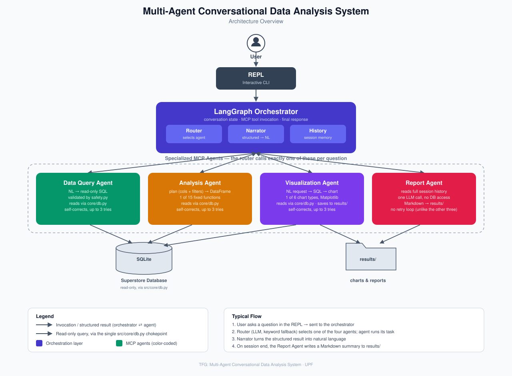

# Multi-Agent Conversational Data Analysis System

Bachelor's Thesis (TFG)

**Author:** Eric Amargant Gutiérrez


**Degree:** Bachelor's Degree in Mathematical Engineering in Data Science


**University:** Universitat Pompeu Fabra (UPF)


**Supervisor:** Piotr Przybyła

---

## Overview

This project implements a conversational system that answers natural
language questions over structured datasets using a modular multi-agent
architecture. The system combines Large Language Models (LLMs), LangGraph
for orchestration, and the Model Context Protocol (MCP) to coordinate
specialized agents responsible for SQL querying, statistical analysis,
visualization, and report generation.

The objective is to investigate how agent-based architectures can improve
natural language interaction with structured data while maintaining a
clear separation of responsibilities between system components, and to
empirically evaluate how much that architecture actually buys you over a
single, minimally-prompted LLM.

---

## Architecture

<p align="center">
  
</p>

The system consists of four specialized MCP agents coordinated by a
LangGraph orchestrator:

- **SQL Agent** – Generates and executes read-only SQL queries.
- **Analysis Agent** – Performs statistical analyses and machine learning
  over the retrieved data, including filtering by column conditions
  (region, category, date ranges, etc.).
- **Visualization Agent** – Generates charts from natural language
  requests.
- **Report Agent** – Produces a Markdown report summarizing the session.

The orchestrator routes user requests, invokes the appropriate agent over
MCP, maintains the conversation history, and generates the final response
presented to the user. All database access is centralized through
`src/core/db.py`, opened strictly read-only.

A detailed description of the architecture is available in
[`docs/architecture.md`](docs/architecture.md). The rationale for the
restructure applied on top of the original design is documented in
[`MIGRATION.md`](MIGRATION.md) and [`MIGRATION_EVAL.md`](MIGRATION_EVAL.md).

---

## Features

- Multi-agent architecture based on FastMCP
- LangGraph orchestration
- LLM-based routing with a keyword fallback
- Natural language to SQL generation
- Statistical analysis and machine learning, with column-filter support
- Automatic SQL validation and self-correction (shared retry logic)
- Automatic chart generation
- Natural language response generation
- Session report generation
- Conversation history (accumulated per session, consumed by the Report Agent)
- Support for multiple LLM providers (Groq, Ollama, OpenAI, Anthropic)
- A full empirical evaluation against a single-agent baseline (see below)

---

## Technologies

- Python 3.12
- LangGraph
- FastMCP
- LangChain
- SQLite
- pandas, NumPy, SciPy, scikit-learn
- Matplotlib
- Pydantic (structured validation of LLM outputs)
- Groq (default), Ollama, OpenAI, Anthropic

---

## Repository Structure

```text
src/
├── agents/
│   ├── safety.py          read-only SQL guard
│   ├── sql/                agent.py + engine.py + prompts.py
│   ├── viz/                agent.py + engine.py + prompts.py
│   ├── analysis/           agent.py + engine.py + prompts.py + statistics.py
│   └── report/             agent.py + engine.py + prompts.py
├── core/
│   ├── db.py               the only module that opens SQLite
│   ├── retry.py            shared self-correction loop
│   ├── llm_json.py         shared "parse LLM JSON output" helper
│   └── paths.py
├── config/settings.py
├── llm/                    provider-agnostic LLM factory + model registry
├── models/schemas.py       Pydantic validation (AnalysisPlan, ChartSpec, ...)
├── orchestrator/           router, MCP client, narrator, LangGraph graph
├── eval/                   evaluation: benchmark, ground truth, baseline, metrics
├── ingest.py                CSV -> SQLite
└── repl.py                  interactive CLI

scripts/manual_check/        manual live-API smoke scripts (not part of pytest)
tests/                       pytest suite, offline, no API keys needed
docs/                        architecture.md, architecture-diagram.svg, development_log.md
data/                        superstore.csv, superstore.db (gitignored)
results/                     generated charts (gitignored) + results/eval/ (tracked)
```

---

## Installation

Clone the repository:

```bash
git clone https://github.com/EricAmargantGutierrez/tfg-multi-agent-data-analysis.git
cd tfg-multi-agent-data-analysis
```

Create and activate a virtual environment:

```bash
python -m venv .venv
source .venv/bin/activate
```

Install the dependencies:

```bash
pip install -r requirements.txt
```

Copy `.env.example` to `.env` and add the key(s) for the model provider(s)
you'll use.

Place the Superstore CSV at `data/superstore.csv`
([Kaggle: vivek468/superstore-dataset-final](https://kaggle.com/datasets/vivek468/superstore-dataset-final)),
then build the database:

```bash
python -m src.ingest
```

---

## Running the System

Launch the interactive assistant:

```bash
python -m src.repl
```

Example questions:

- How many orders are there?
- Which region has the highest sales?
- What is the average profit in the West region?
- What is the correlation between discount and profit?
- Run a linear regression predicting profit from sales, discount, and quantity.
- Show a line chart of monthly sales.

---

## Evaluation

The full evaluation lives in `src/eval/`; results in `results/eval/`.

```bash
# 1. Generate ground truth against your own database
python -m src.eval.ground_truth.generate_sql_ground_truth
python -m src.eval.ground_truth.generate_analysis_ground_truth
python -m src.eval.ground_truth.generate_visualization_ground_truth

# 2. Run everything (real agents + baseline + routing accuracy)
python -m src.eval.run_all

# 3. See results/eval/summary.csv
```

### Results (55-question benchmark, Groq `llama-3.3-70b`)

| Category | System correctness | Baseline correctness | Architecture value |
|---|---|---|---|
| SQL | 100% (30/30) | 33.3% | +66.7pp |
| Analysis | 100% (15/15) | ~20–27%\* | +73–80pp |
| Visualization | 100% (10/10) | 80.0% | +20.0pp |

Routing accuracy across all 55 questions: **90.9%**.

\* Baseline correctness on Analysis varied slightly between runs due to
LLM sampling non-determinism; the real Analysis Agent was stable at
93–100%. See `docs/development_log.md` (Milestone 12) for the full
discussion, including characterized baseline failure modes (missing
SQLite statistical functions, a hardcoded rule masquerading as K-Means
clustering, etc.) and a genuine bug found and fixed during evaluation
(the Analysis Agent's regression target was inferred from column-list
position rather than being explicit — fixed via `AnalysisPlan.target`).

The baseline uses a deliberately minimal prompt (not the tuned agent
prompts), isolating the value of the full architecture rather than just
measuring prompt quality — see `docs/architecture.md` for the full
methodology and its documented limitations.

---

## Testing

```bash
PYTHONPATH=. pytest tests/ -v
```

Runs entirely offline — no API key required (78 tests). For manual,
live-API checks (actual LLM calls), see `scripts/manual_check/`.

---

## Documentation

- [`docs/architecture.md`](docs/architecture.md) — system architecture,
  execution flow, and the design decisions behind it.
- [`docs/development_log.md`](docs/development_log.md) — project
  implementation log, including the full evaluation writeup (Milestone 12).
- [`MIGRATION.md`](MIGRATION.md) / [`MIGRATION_EVAL.md`](MIGRATION_EVAL.md)
  — records of the architecture restructure and the evaluation build.

---

## Current Status

**Phase 1 (system implementation)** and **Phase 2 (evaluation)** are both
complete. The system includes the full multi-agent architecture,
centralized read-only database access, an automated offline test suite
(78 tests), and a complete empirical evaluation against a single-agent
baseline with routing accuracy, retry statistics, and latency comparisons.

Remaining: a manual qualitative (1–5) rating of narrated answer quality,
and the thesis write-up itself (Evaluation Methodology, Results, and
Failure Analysis chapters).

---

## License

This project was developed as part of a Bachelor's Thesis at Universitat
Pompeu Fabra.
